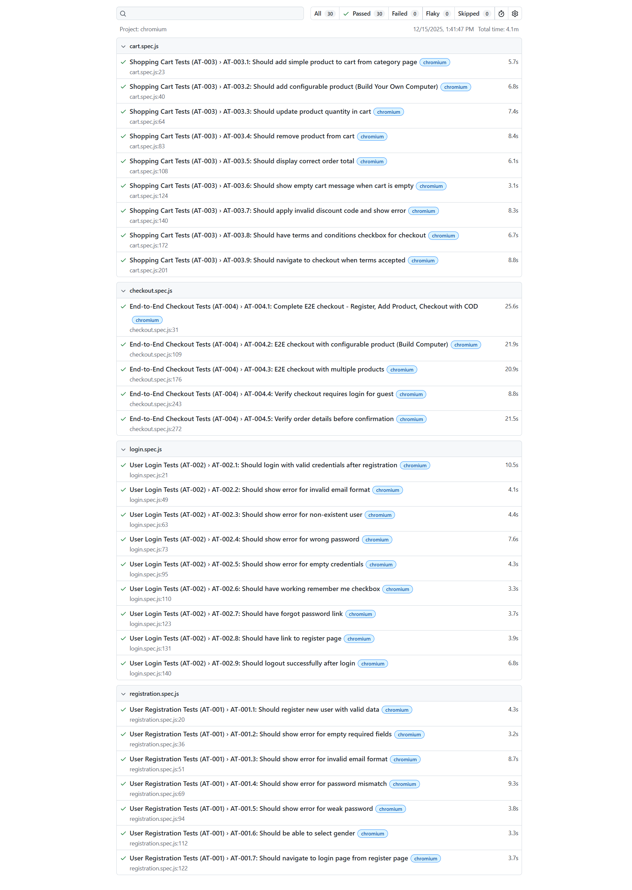

# Automated Test Execution Report

## Demo Web Shop - https://demowebshop.tricentis.com/

**Project:** Tricentis DemoWebShop QA Suite  
**Prepared By:** Lakindu De Silva  
**Execution Date:** December 15, 2025  
**Version:** 1.0

---

## 1. Executive Summary

| Metric                   | Value                  |
| ------------------------ | ---------------------- |
| **Total Tests**          | 30                     |
| **Passed**               | 30 ✅                  |
| **Failed**               | 0 ❌                   |
| **Flaky**                | 0 ⚠️                   |
| **Skipped**              | 0 ⏭️                   |
| **Pass Rate**            | 100%                   |
| **Total Execution Time** | 4.1 minutes            |
| **Browser**              | Chromium               |
| **Execution Date**       | 12/15/2025, 1:41:47 PM |

---

## 2. Test Execution Screenshot



---

## 3. Test Suite Breakdown

### 3.1 Registration Tests (AT-001) - 7 Tests

| Test ID  | Test Name                                        | Duration | Status  |
| -------- | ------------------------------------------------ | -------- | ------- |
| AT-001.1 | Should register new user with valid data         | 4.3s     | ✅ Pass |
| AT-001.2 | Should show error for empty required fields      | 3.2s     | ✅ Pass |
| AT-001.3 | Should show error for invalid email format       | 8.7s     | ✅ Pass |
| AT-001.4 | Should show error for password mismatch          | 9.3s     | ✅ Pass |
| AT-001.5 | Should show error for weak password              | 3.8s     | ✅ Pass |
| AT-001.6 | Should be able to select gender                  | 3.3s     | ✅ Pass |
| AT-001.7 | Should navigate to login page from register page | 3.7s     | ✅ Pass |

**Suite Status:** ✅ 7/7 Passed

---

### 3.2 Login Tests (AT-002) - 9 Tests

| Test ID  | Test Name                                              | Duration | Status  |
| -------- | ------------------------------------------------------ | -------- | ------- |
| AT-002.1 | Should login with valid credentials after registration | 10.5s    | ✅ Pass |
| AT-002.2 | Should show error for invalid email format             | 4.1s     | ✅ Pass |
| AT-002.3 | Should show error for non-existent user                | 4.4s     | ✅ Pass |
| AT-002.4 | Should show error for wrong password                   | 7.6s     | ✅ Pass |
| AT-002.5 | Should show error for empty credentials                | 4.3s     | ✅ Pass |
| AT-002.6 | Should have working remember me checkbox               | 3.3s     | ✅ Pass |
| AT-002.7 | Should have forgot password link                       | 3.7s     | ✅ Pass |
| AT-002.8 | Should have link to register page                      | 3.9s     | ✅ Pass |
| AT-002.9 | Should logout successfully after login                 | 6.8s     | ✅ Pass |

**Suite Status:** ✅ 9/9 Passed

---

### 3.3 Shopping Cart Tests (AT-003) - 9 Tests

| Test ID  | Test Name                                                 | Duration | Status  |
| -------- | --------------------------------------------------------- | -------- | ------- |
| AT-003.1 | Should add simple product to cart from category page      | 5.7s     | ✅ Pass |
| AT-003.2 | Should add configurable product (Build Your Own Computer) | 6.8s     | ✅ Pass |
| AT-003.3 | Should update product quantity in cart                    | 7.4s     | ✅ Pass |
| AT-003.4 | Should remove product from cart                           | 8.4s     | ✅ Pass |
| AT-003.5 | Should display correct order total                        | 6.1s     | ✅ Pass |
| AT-003.6 | Should show empty cart message when cart is empty         | 3.1s     | ✅ Pass |
| AT-003.7 | Should apply invalid discount code and show error         | 8.3s     | ✅ Pass |
| AT-003.8 | Should have terms and conditions checkbox for checkout    | 6.7s     | ✅ Pass |
| AT-003.9 | Should navigate to checkout when terms accepted           | 8.8s     | ✅ Pass |

**Suite Status:** ✅ 9/9 Passed

---

### 3.4 Checkout Tests (AT-004) - 5 Tests

| Test ID  | Test Name                                                        | Duration | Status  |
| -------- | ---------------------------------------------------------------- | -------- | ------- |
| AT-004.1 | Complete E2E checkout - Register, Add Product, Checkout with COD | 25.6s    | ✅ Pass |
| AT-004.2 | E2E checkout with configurable product (Build Computer)          | 21.9s    | ✅ Pass |
| AT-004.3 | E2E checkout with multiple products                              | 20.9s    | ✅ Pass |
| AT-004.4 | Verify checkout requires login for guest                         | 8.8s     | ✅ Pass |
| AT-004.5 | Verify order details before confirmation                         | 21.5s    | ✅ Pass |

**Suite Status:** ✅ 5/5 Passed

---

## 4. Test Coverage by Requirement

| Requirement                 | Tests | Passed | Coverage |
| --------------------------- | ----- | ------ | -------- |
| TR-001: User Registration   | 7     | 7      | ✅ 100%  |
| TR-002: User Authentication | 9     | 9      | ✅ 100%  |
| TR-004: Shopping Cart       | 9     | 9      | ✅ 100%  |
| TR-006: Checkout Process    | 5     | 5      | ✅ 100%  |
| TR-008: Form Validations    | 10    | 10     | ✅ 100%  |

---

## 5. Test Artifacts

### 5.1 Playwright HTML Report (Attached)

The complete Playwright test execution report has been exported and attached:

📄 **[Automated-Test-Execution-Report.pdf](Automated-Test-Execution-Report.pdf)**

This PDF contains the full interactive Playwright HTML report showing:

- All 30 test cases with pass/fail status
- Individual test durations
- Test suite groupings by feature
- Execution timestamps and browser details

### 5.2 Screenshot Evidence


---

## 6. Environment Details

| Component          | Value                              |
| ------------------ | ---------------------------------- |
| **Test Framework** | Playwright v1.57.0                 |
| **Language**       | JavaScript                         |
| **Browser**        | Chromium (Latest)                  |
| **OS**             | Windows                            |
| **Base URL**       | https://demowebshop.tricentis.com/ |
| **Pattern**        | Page Object Model (POM)            |
| **Reporter**       | HTML                               |

---

## 7. Test Execution Command

```powershell
# Run all tests with HTML report
npx playwright test --reporter=html

# View the report
npx playwright show-report
```

---

## 8. Conclusion

All 30 automated test cases have been executed successfully with a **100% pass rate**. The automation suite covers the following critical functionalities:

- ✅ User Registration (7 tests)
- ✅ User Login/Logout (9 tests)
- ✅ Shopping Cart Operations (9 tests)
- ✅ End-to-End Checkout (5 tests)

**Recommendation:** The application under test (Demo Web Shop) meets all tested requirements and is functioning as expected for the automated test scenarios.

---

## 9. Sign-Off

| Role        | Name             | Signature      | Date       |
| ----------- | ---------------- | -------------- | ---------- |
| QA Engineer | Lakindu De Silva | \***\*\_\*\*** | 12/15/2025 |

---

## Appendix: Quick Reference Commands

```powershell
# Run all tests
npx playwright test

# Run specific test file
npx playwright test automation/tests/login.spec.js

# Run with UI mode
npx playwright test --ui

# Run with trace on failure
npx playwright test --trace on-first-retry

# Generate report after run
npx playwright show-report
```
